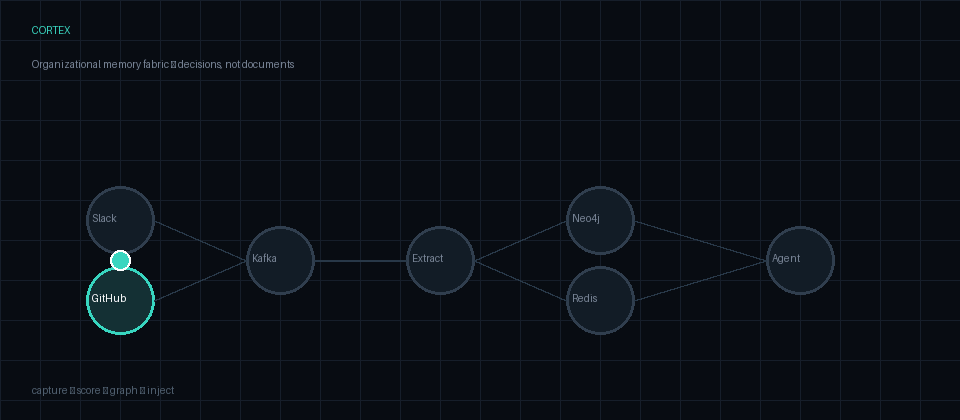
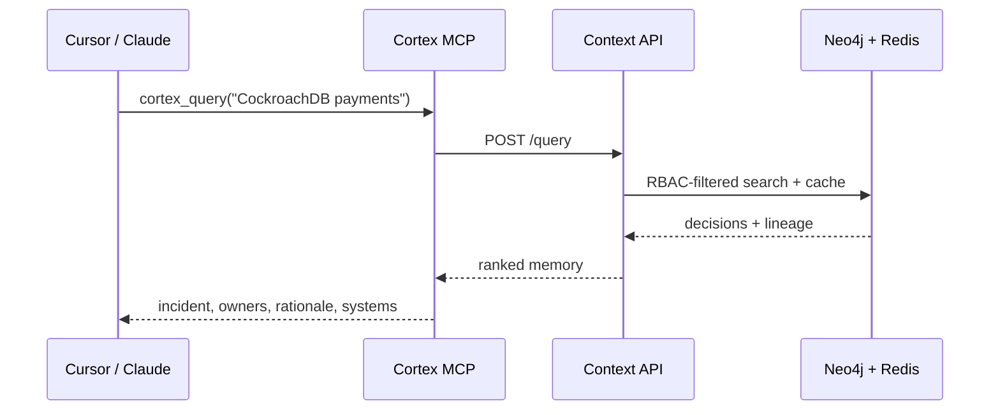

# Cortex

[](https://github.com/askmy-stack/cortex/actions/workflows/ci.yml)
[](LICENSE)
[](pyproject.toml)
[](mcp/)

**The organizational memory operating system for AI-native companies.**

> Give every AI agent in your organization the same context a senior engineer has — and keep it current as your organization evolves.

**Thesis:** AI tools are stateless. Organizations are not. Every agent starting from zero is a **memory infrastructure failure** — not a model failure.

<p align="center">
  
</p>

<p align="center">
  <em>Capture decisions from every tool → structure in a knowledge graph → actively inject context at inference time via MCP.</em>
</p>

| In 3 minutes | Command |
|---|---|
| **Live demo** | [cortex-blush-theta.vercel.app](https://cortex-blush-theta.vercel.app) (dashboard; set `CORTEX_API_ORIGIN` on Vercel for API-backed search) |
| **Run locally** | `make demo` → [localhost:3000](http://localhost:3000) |
| **Ask a question** | Workspace `local-dev` → *Why CockroachDB for payments?* |
| **Wire an agent** | Add the MCP block below — `cortex_query`, `cortex_inject`, `cortex_remember` |

---

## The Problem

Every company running AI today has the same silent failure.

Tools think. Agents act. Nothing remembers.

- A Cursor session doesn't know what was decided in the Slack thread
- The support agent doesn't know the sales context from last quarter
- The new engineer's Copilot doesn't know why the architecture was built this way
- The code review bot doesn't know which constraints are architectural vs. temporary

Every AI interaction starts from zero. Every time.

This isn't a model problem. Every major lab has solved reasoning.

**It's a memory infrastructure problem.** And no tool has solved it.

---

## What Cortex Does

```
Captures decisions → Structures them → Injects context → Agents act intelligently
```

**Cortex captures decisions, not documents.**

When your team decides to migrate the payments service to CockroachDB, Cortex captures:

```json
{
  "type": "architectural_decision",
  "decision": "Migrate payments service to CockroachDB",
  "replaces": "PostgreSQL",
  "rationale": ["scale ceiling at 10M txn/day", "multi-region replication needed"],
  "made_by": ["priya@", "dan@"],
  "triggered_by": "incident #247",
  "affects": ["payments-service", "billing-service"],
  "date": "2026-05-09",
  "status": "active"
}
```

Not the Slack message. Not a document. The **decision** — structured, linked, queryable.

**Then Cortex actively injects it.**

When any agent touches the payments service, Cortex enriches its context automatically:

```
"Why does payments use CockroachDB?"
→ Cortex returns: the incident that triggered it, who decided it,
  the tradeoffs discussed, the migration PR, known edge cases since.
→ Agent answers correctly. No hallucination. No archaeology.
```

---

## Key Capabilities

| Capability | Description |
|---|---|
| **Decision capture** | Extracts structured decisions from Slack, GitHub, Jira, Linear, meetings |
| **Knowledge graph** | Neo4j graph: Decision → Person → System → Exception → Outcome |
| **Active injection** | Pushes relevant context to agents before they act — not after they ask |
| **MCP server** | Native MCP endpoint — any Claude, Cursor, or MCP agent gets memory in one config line |
| **Importance scoring** | Filters noise at ingestion — only signal reaches the graph |
| **Trust scoring** | Bayesian confidence per memory node — bad inputs don't corrupt memory |
| **Contradiction detection** | Flags when new events conflict with existing memory — no silent overwrites |
| **Memory decay** | Old memory compresses and archives on a principled schedule |
| **Coverage scoring** | Per-domain completeness estimate — agents know when memory is thin |
| **RBAC** | Graph-level access control — contractors don't see salary decisions |
| **Outcome tracking** | Links decisions to real metrics — memory becomes self-correcting |
| **GDPR erasure** | Cascade delete with audit trail; query cache invalidated per workspace |

---

## Production hardening (launch-ready)

These behaviors matter when Cortex runs behind auth in preview or production:

| Concern | Behavior |
|---|---|
| **GDPR erasure** | `POST /gdpr/erase` bumps a per-workspace Redis cache epoch — stale PII cannot be served from `/query` for up to 60s |
| **Dashboard proxy** | nginx on `:3000` forwards `/gdpr` (and `/query`, `/inject`, …) to the API — same-origin demos work |
| **Demo smoke test** | `scripts/demo.sh` sources `.env` and sends `Authorization` when `CORTEX_DEMO_API_KEY` or `CORTEX_API_KEYS` is set |
| **Pipeline retries** | Transient Neo4j errors do not commit Kafka offsets or land in DLQ — messages are redelivered |
| **CMVK fail-fast** | `CORTEX_CMVK_BACKEND=openai\|ollama` validates credentials/reachability at worker startup |

```bash
# Preview / staging .env snippet
CORTEX_API_KEYS=preview-key:admin;authenticated
CORTEX_DEMO_API_KEY=preview-key
CORTEX_CMVK_BACKEND=heuristic   # zero-cost local demo; use openai + OPENAI_API_KEY in prod
```

Regenerate the README animation: `python scripts/generate_readme_demo_gif.py` → `docs/assets/cortex-memory-fabric.gif`

---

## Deploy

| Goal | Guide |
|------|--------|
| **$0 portfolio demo** (Cloudflare Pages + Render free + Aura + Upstash) | [docs/DEPLOY-FREE.md](docs/DEPLOY-FREE.md) |
| **Production split** (Vercel dashboard + Railway/Render API) | [docs/DEPLOY.md](docs/DEPLOY.md) |

After deploy, verify end-to-end: `./scripts/verify_free_deploy.sh --api https://YOUR_API --pages https://YOUR_PAGES`

---

## Architecture

```
┌──────────────────────────────────────────────────────────────┐
│  CAPTURE LAYER                                                │
│  Slack · GitHub · Jira · Linear · Meetings · CI/CD          │
│  Real-time event streams via webhooks + OAuth connectors     │
└───────────────────────────────┬──────────────────────────────┘
                                │ Kafka
┌───────────────────────────────▼──────────────────────────────┐
│  EXTRACTION ENGINE                                            │
│  Decision extractor (GPT-4o structured output)              │
│  Entity resolver (spaCy NER → canonical org entities)       │
│  Importance scorer (filters noise before storage)           │
│  Event classifier (decision/exception/rationale/update)     │
└───────────────────────────────┬──────────────────────────────┘
                                │
┌───────────────────────────────▼──────────────────────────────┐
│  MEMORY FABRIC                                                │
│  Episodic    → TimescaleDB  what happened and when           │
│  Semantic    → Qdrant       what things mean                 │
│  Structural  → Neo4j        relationships + causal chains    │
│  Procedural  → Neo4j        how things are done              │
│  Hot cache   → Redis        <50ms retrieval for live agents  │
└───────────────────────────────┬──────────────────────────────┘
                                │
┌───────────────────────────────▼──────────────────────────────┐
│  INTELLIGENCE LAYER                                           │
│  Contradiction detector · Decay engine · Trust scorer       │
│  Coverage scorer · Outcome linker · RBAC enforcer           │
└───────────────────────────────┬──────────────────────────────┘
                                │
┌───────────────────────────────▼──────────────────────────────┐
│  CONTEXT API                                                  │
│  MCP server   · REST API · Python SDK · TypeScript SDK      │
│  cortex.query() · cortex.inject() · cortex.remember()       │
└──────────────────────────────────────────────────────────────┘
```

---

## Quickstart

**Fastest path — seeded demo (recommended):**

```bash
git clone https://github.com/askmy-stack/cortex
cd cortex
cp .env.example .env   # optional; compose defaults work for local demo
make demo              # infra + migrations + seed + API + worker + dashboard
open http://localhost:3000
```

On the dashboard, open **Ask**, use workspace `local-dev`, and try: *Why CockroachDB for payments?*

### Manual setup

```bash
# Core infra (Kafka, Neo4j, Redis, Postgres)
docker compose up -d

# API + pipeline worker + dashboard (production-like via Docker)
docker compose --profile api --profile frontend up -d --build

# Connect Slack (optional — requires tokens in .env)
python scripts/connect_slack.py --workspace your-workspace
```

**UI development (hot reload):** `cd frontend && npm run dev` → [http://localhost:5173](http://localhost:5173)  
**Docker dashboard:** [http://localhost:3000](http://localhost:3000) (rebuild frontend image after UI changes — see note below)

### One-command demo (details)

From the repo root, with Docker running:

```bash
cp .env.example .env   # optional if you rely on compose defaults
make demo              # or: bash scripts/demo.sh
```

This brings up Kafka, Neo4j, Redis, Postgres, applies graph migrations, writes two demo `Decision` nodes (CockroachDB migration story + Redis session cache), starts the API, pipeline worker, and dashboard, then runs a sample `POST /query`. Open [http://localhost:3000](http://localhost:3000) and use **Ask** with workspace `local-dev` and a question like `Why CockroachDB for payments?`.

**API auth enabled?** Set `CORTEX_API_KEYS` in `.env` (format: `key:admin;authenticated`) and optionally `CORTEX_DEMO_API_KEY` to the same key so `make demo` smoke curl authenticates. The dashboard nginx proxy forwards `/gdpr` to the API for same-origin GDPR erasure from port 3000.

**CMVK in production:** Default `CORTEX_CMVK_BACKEND=heuristic` needs no LLM. For `openai` or `ollama`, set `OPENAI_API_KEY` or run Ollama — the pipeline worker fails fast at startup if the backend is misconfigured (avoids silently quarantining all high-stakes writes).

**Dashboard looks stale?** The UI is served from a Docker image on port **3000**. Rebuild with `docker compose --profile api --profile frontend build frontend && docker compose --profile api --profile frontend up -d --force-recreate frontend`, then hard-refresh the browser (`Cmd+Shift+R`). For hot reload during UI work, run `cd frontend && npm run dev` → [http://localhost:5173](http://localhost:5173) (dev server uses **5173** so it does not clash with Docker).

**Recording a video or GIF for the README:** see [docs/DEMO_RECORDING.md](docs/DEMO_RECORDING.md). **Validating real webhooks (Slack / GitHub / Jira):** [docs/CONNECTOR_VALIDATION.md](docs/CONNECTOR_VALIDATION.md).

### Context API (REST)

| Method | Path | Purpose |
|--------|------|---------|
| `GET` | `/health` | Liveness and dependency checks (Neo4j, Redis) |
| `GET` | `/metrics` | Prometheus exposition (request + query latency histograms) |

Set `OTEL_EXPORTER_OTLP_ENDPOINT` to enable distributed tracing (OpenTelemetry OTLP HTTP).
| `POST` | `/query` | Decision search (Neo4j full-text + optional Qdrant merge when `CORTEX_SEMANTIC_ENABLED=true`) |
| `POST` | `/inject` | Ranked context for agents |
| `GET` | `/contradictions/pending` | Pending contradiction review items (`workspace_id` query param; `X-Cortex-Roles` for RBAC) |
| `GET` | `/decisions/by-system/{system_id}` | Recent decisions affecting a service |
| `GET` | `/decisions/{id}/chain` | SUPERSEDES / trigger lineage |
| `GET` | `/decisions/{id}/conflicts` | Contradiction preview on shared systems |
| `POST` | `/remember` | Submit explicit memory → Kafka → extractor → graph |
| `POST` | `/gdpr/erase` | GDPR Right to Erasure — cascade delete subject memory (`admin` / `gdpr_officer` / `legal`); invalidates per-workspace query cache |
| `POST` | `/webhooks/slack`, `/github`, `/jira`, `/linear` | Connector ingress → Kafka |

Use `docker compose --profile api up` to build the API and pipeline worker, or run `uvicorn api.main:app --reload` from the repo root with services in `.env`.

**Python SDK:**

```python
from sdk import CortexClient

client = CortexClient("http://localhost:8000")
print(client.query("Why CockroachDB?", workspace_id="local-dev"))
client.remember("We use Redis for session cache.", workspace_id="local-dev")
```

**Add to any MCP-compatible agent (Claude, Cursor) — stdio server in `mcp/`:**

```json
{
  "mcpServers": {
    "cortex": {
      "command": "node",
      "args": ["/path/to/Cortex/mcp/server.js"],
      "env": { "CORTEX_API_URL": "http://localhost:8000" }
    }
  }
}
```

Tools: `cortex_query`, `cortex_inject`, `cortex_remember`.

### Dashboard

The web UI is aimed at engineers, PMs, and operators — not only developers reading JSON.

| Area | What it does |
|------|----------------|
| **Home** | Product overview + API health |
| **Ask** | Natural-language search over organizational memory |
| **Memory map** | Relationship graph, timeline, decision lineage |
| **For agents** | Preview what `POST /inject` would send to an MCP client |
| **Review** | Pending contradiction queue |
| **Cortex Guide** | In-app assistant that explains results in plain language |

---

## The Demo

New engineer opens Cursor. Asks:

> *"Why does the payments service use CockroachDB instead of Postgres?"*

| Without Cortex | With Cortex |
|---|---|
| Agent guesses or says *"I don't know"* | Returns incident #247, decision owners, tradeoffs, migration PR, edge cases since |
| Slack archaeology, stale Confluence | Structured `DecisionEvent` from the live graph |
| Every session starts at zero | MCP `cortex_inject` pushes context **before** inference |

Full context. ~3 seconds. No archaeology.



---

## Project Structure

```
cortex/
├── connectors/           # Tool connectors (Slack, GitHub, Jira, Linear)
│   ├── slack/
│   ├── github/
│   ├── jira/
│   └── linear/
├── extraction/           # Decision extractor, entity resolver, classifier
├── scoring/              # Importance scorer, trust scorer, coverage scorer
├── graph/                # Neo4j schema, migrations, Cypher queries
│   └── migrations/       # V001__initial_schema.cypher, etc.
├── pipeline/             # Kafka extraction worker (raw → graph)
├── memory/               # Episodic (Timescale) + semantic (Qdrant) helpers
├── intelligence/         # Contradiction detector, decay engine, outcome linker
├── api/                  # FastAPI application
├── mcp/                  # MCP server (TypeScript)
├── sdk/                  # Python client (query, inject, remember)
├── frontend/             # React dashboard
├── infrastructure/       # Terraform, Docker configs
├── tests/
├── scripts/              # Setup, seed data, utilities
├── docs/                 # Architecture diagrams, ADRs
├── CLAUDE.md             # Agent operating instructions
├── SESSIONS.md           # Build session log
├── DECISIONS.md          # Decision log + agent instructions
├── MISTAKES.md           # Errors and learnings
└── ARCHITECTURE.md       # Full system architecture spec
```

---

## Tech Stack

| Layer | Technology |
|---|---|
| Event streaming | Apache Kafka |
| Decision extraction | GPT-4o function calling (prod) / Ollama Gemma (dev) |
| NER + entity resolution | spaCy + custom models |
| Knowledge graph | Neo4j 5 |
| Vector store | Qdrant |
| Time-series | TimescaleDB |
| Cache | Redis |
| API | FastAPI + JWT |
| MCP server | TypeScript (MCP SDK) |
| Agent runtime | LangGraph |
| Frontend | React + Vite (dashboard: Ask, memory map, Cortex Guide) |
| IaC | Terraform + AWS ECS |
| Observability | Prometheus + Grafana |
| ML tracking | MLflow |
| Auth | Auth0 + JWT + DID (agent identity) |

---

## Roadmap

| Phase | Scope | Status |
|---|---|---|
| Phase 0 | Architecture + documentation | ✅ Done |
| Phase 1 | Kafka + Slack connector + decision extractor | ✅ Core shipped |
| Phase 2 | GitHub + Jira + Linear connectors + Neo4j graph | ✅ Shipped (webhooks → Kafka → worker) |
| Phase 3 | REST API (`/query`, `/inject`) + MCP + Python SDK | ✅ Shipped |
| Phase 4 | Importance + trust scoring + graph RBAC | ✅ Shipped |
| Phase 5 | Contradiction detector + decay engine | ✅ Shipped |
| Phase 6 | React dashboard (Ask, memory map, guide, agent inject) | ✅ Shipped |
| Phase 7 | Live demo URL + demo video + open-source launch | 🔄 In progress |
| Phase 8 | Outcome tracking + coverage scoring | ⏳ Post-launch |
| Phase 9 | Elicitation bot (implicit knowledge) | ⏳ Post-launch |
| Phase 10 | Federated cross-org memory | ⏳ v2 |

**CI:** GitHub Actions runs `pytest` + seed dry-run on push/PR ([`.github/workflows/ci.yml`](.github/workflows/ci.yml)).

---

## Why This Exists

Every existing solution falls into one of two camps:

**Memory systems** (Mem0, Zep, Cognee) — deep on architecture, no cross-tool capture, single-agent scope, no decision extraction.

**Enterprise search** (Glean, Notion AI, Dust) — deep on connectors, pull-based only, no temporal graph, no causal reasoning, no decision capture.

Cortex is the infrastructure layer in the gap between both camps.

The combination — cross-tool capture + decision extraction + temporal causal graph + active MCP injection + importance scoring + organizational scope — does not exist in any open-source or commercial product.

---

## Research Foundation

Built on:
- **MAGMA** (arXiv:2601.03236) — four-graph memory architecture (semantic/temporal/causal/entity)
- **Zep/Graphiti** (arXiv:2501.13956) — temporal edge invalidation, 90% latency reduction
- **A-MEM** (NeurIPS 2025, arXiv:2502.12110) — Zettelkasten dynamic memory linking
- **Field-Theoretic Memory** (arXiv:2602.21220) — thermodynamic memory decay (+116% F1)
- **SSGM Framework** (arXiv:2603.11768) — memory stability and safety governance
- **Context Engineering** (arXiv:2603.09619) — CE as organizational infrastructure

---

## License

Apache 2.0 — use it, fork it, build on it.
