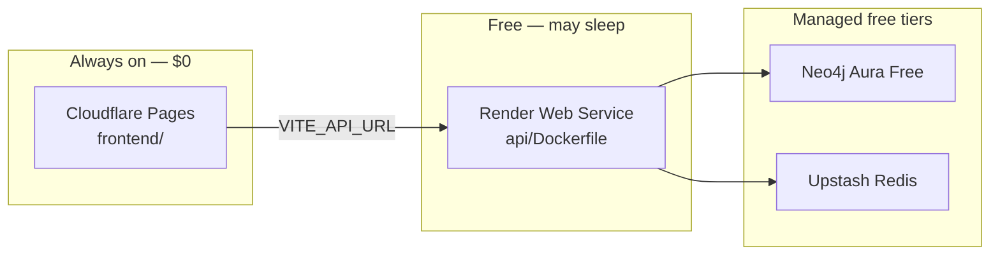

# Plan A — $0 deployment (Cloudflare Pages + Render + Aura + Upstash)

Portfolio demo at **$0/month**: dashboard 24/7 on Cloudflare Pages, API on Render free tier (cold start after idle), Neo4j Aura Free, Upstash Redis Free. **No Kafka** — seed the graph directly.

For the full paid/split deploy map see [DEPLOY.md](./DEPLOY.md).

---

## Architecture



| Component | Platform | Cost |
|-----------|----------|------|
| Dashboard | Cloudflare Pages | $0 |
| API | Render (free plan) | $0 |
| Graph | Neo4j Aura Free | $0 |
| Cache | Upstash Redis | $0 |
| Kafka / worker | Skipped | — |

**Tradeoff:** Render free services **sleep after ~15 minutes** of no traffic. First request after idle may take 30–60 seconds. The dashboard stays fast; only API calls wait.

---

## Phase 1 — Data layer (~15 min)

### 1. Neo4j Aura Free

1. [neo4j.com/cloud/aura-free](https://neo4j.com/cloud/aura-free/) → create instance  
2. Save `NEO4J_URI` (`neo4j+s://…`), user `neo4j`, password  

### 2. Upstash Redis

1. [console.upstash.com](https://console.upstash.com) → Create Redis database  
2. Copy `REDIS_URL` (`rediss://…`)  

### 3. Seed from your laptop (recommended)

```bash
export NEO4J_URI=neo4j+s://xxxx.databases.neo4j.io
export NEO4J_USER=neo4j
export NEO4J_PASSWORD=your-password

uv run python graph/migrate.py
uv run python scripts/seed_demo.py --workspace local-dev --scale small
```

Optional second workspace (dual-workspace demo):

```bash
uv run python scripts/import_github_graph.py \
  --org tiangolo --repo fastapi \
  --workspace oss-tiangolo-fastapi --limit 30
```

---

## Phase 2 — API on Render (~20 min)

### Option A — Blueprint (repo includes `render.yaml`)

1. [dashboard.render.com](https://dashboard.render.com) → **New** → **Blueprint**  
2. Connect `askmy-stack/cortex` (use branch `main` after merge, or your feature branch)  
3. Render reads [`render.yaml`](../render.yaml)  

### Option B — Manual Web Service

1. **New** → **Web Service** → connect repo  
2. **Runtime:** Docker  
3. **Dockerfile path:** `api/Dockerfile`  
4. **Docker context:** `.` (repo root)  
5. **Plan:** Free  

### Required environment variables (Render → Environment)

| Variable | Value |
|----------|--------|
| `NEO4J_URI` | Aura URI |
| `NEO4J_USER` | `neo4j` |
| `NEO4J_PASSWORD` | Aura password |
| `REDIS_URL` | Upstash URL |
| `CORTEX_SEMANTIC_ENABLED` | `false` |
| `EXTRACTION_BACKEND` | `heuristic` |
| `CORTEX_SEED_DEMO` | `true` on **first** deploy only, then `false` |
| `CORS_ORIGINS` | Your Cloudflare Pages URL (see Phase 3) |
| `CORTEX_API_KEYS` | optional, e.g. `demo-readonly:authenticated` |

After deploy, copy the public URL: `https://cortex-api-xxxx.onrender.com`

### Verify API

```bash
export API=https://cortex-api-xxxx.onrender.com
curl -s "$API/health" | jq .
curl -s -X POST "$API/query" \
  -H "Content-Type: application/json" \
  -d '{"query":"Why CockroachDB?","workspace_id":"local-dev","limit":5}' | jq .
```

Or run [`scripts/verify_free_deploy.sh`](../scripts/verify_free_deploy.sh) (see below).

---

## Phase 3 — Dashboard on Cloudflare Pages (~15 min)

Cloudflare Pages does **not** run Vercel Edge Middleware. Point the dashboard at Render with a **build-time** env var.

1. [dash.cloudflare.com](https://dash.cloudflare.com) → **Workers & Pages** → **Create** → **Pages** → **Connect to Git**  
2. Select `askmy-stack/cortex`  
3. **Build settings:**

| Setting | Value |
|---------|--------|
| Production branch | `main` (after merge) |
| Root directory | `frontend` |
| Build command | `npm run build` |
| Build output directory | `dist` |

4. **Environment variables** (Production + Preview):

| Variable | Value |
|----------|--------|
| `VITE_API_URL` | `https://cortex-api-xxxx.onrender.com` (no trailing slash) |
| `VITE_CORTEX_API_KEY` | optional — same as `CORTEX_API_KEYS` if auth enabled |

5. **Deploy** → URL: `https://cortex-dashboard.pages.dev` (or custom subdomain)

### CORS on Render

Set `CORS_ORIGINS` on the API to your Pages URL:

```text
https://cortex-dashboard.pages.dev,https://your-preview.pages.dev
```

Redeploy API after changing CORS.

### CLI alternative (optional)

From `frontend/` with [Wrangler](https://developers.cloudflare.com/workers/wrangler/) installed:

```bash
cd frontend
npm run build
npx wrangler pages deploy dist --project-name=cortex-dashboard
```

See [`frontend/wrangler.toml`](../frontend/wrangler.toml).

---

## Phase 4 — Merge PR stack to `main`

Deploy from `main` for stable URLs. Merge order:

1. [#18](https://github.com/askmy-stack/cortex/pull/18) Reliability  
2. [#19](https://github.com/askmy-stack/cortex/pull/19) Consistency  
3. [#20](https://github.com/askmy-stack/cortex/pull/20) Onboarding  
4. [#21](https://github.com/askmy-stack/cortex/pull/21) Ask + Home  
5. [#22](https://github.com/askmy-stack/cortex/pull/22) Explore  
6. [#23](https://github.com/askmy-stack/cortex/pull/23) QA + a11y  
7. [#24](https://github.com/askmy-stack/cortex/pull/24) Plan A free deploy *(after this PR is opened)*  

Close [#17](https://github.com/askmy-stack/cortex/pull/17) once the UI stack + Plan A land on `main` (superseded).

Point Cloudflare Pages and Render at `main` after merge.

---

## Verification checklist

- [ ] `curl $API/health` → `status: ok`, `neo4j` + `redis` ok  
- [ ] `POST $API/query` → ≥1 decision for `local-dev`  
- [ ] Pages URL loads Home without white screen  
- [ ] Ask search returns results (may wait for API cold start once)  
- [ ] Connection panel accepts API key if `CORTEX_API_KEYS` is set  

```bash
./scripts/verify_free_deploy.sh \
  --api https://cortex-api-xxxx.onrender.com \
  --pages https://cortex-dashboard.pages.dev
```

---

## README one-liner (portfolio)

```markdown
**Live demo:** https://your-project.pages.dev  
*(API on Render free tier — first load after idle may take ~30s)*
```

---

## Troubleshooting

| Symptom | Fix |
|---------|-----|
| CORS error in browser | Set `CORS_ORIGINS` on Render to exact Pages origin (`https://…pages.dev`) |
| Query 502 / timeout | Render service sleeping — retry after 30–60s |
| Empty Ask results | Re-run `seed_demo.py` or set `CORTEX_SEED_DEMO=true` once on Render |
| Vercel Python 5 GB bundle | Use Cloudflare Pages with Root Directory `frontend` instead |
| `neo4j` unhealthy | Check Aura URI, password, IP allowlist (Aura allows all by default) |

---

## What stays local ($0 cloud cannot run)

- Kafka + `pipeline-worker` live ingestion  
- Full `docker-compose` observability stack  
- Semantic/Qdrant search (`CORTEX_SEMANTIC_ENABLED=false`)  

Use `make demo` locally for the full stack story; use Plan A for the public portfolio URL.
